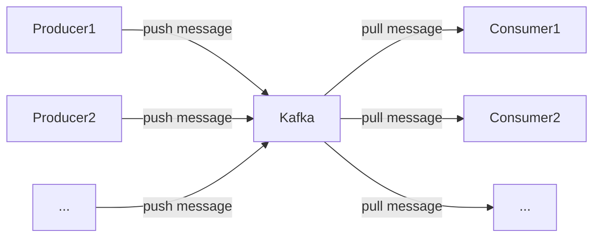
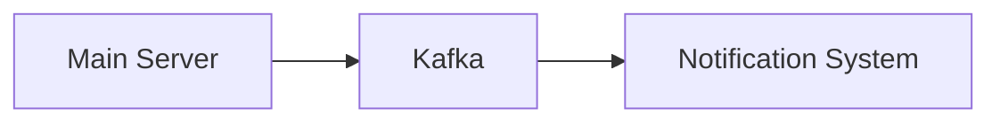

Message Queue is used for some asynchronous tasks and making the application more extendable in the future.

Currently, we use Kafka as the message queue, and it's only used for email ownership verification (with a notifiction service).

I designed a plugin system on client-side to let users customize what they need. Later, if I could find a proper use case, Kafka could be used to implement a similar server-side plugin system with the [open-closed principle](https://en.wikipedia.org/wiki/Open%E2%80%93closed_principle) in mind.

This is a basic illustration of Kafka.



## CrossCopy Message Queue Design

## Signup Topic



During the signup process, a email ownership verification is required. This process can be done by the server or using another service. Since this process doesn't need to be realtime (asynchronous), and there could be potentially other consumers for `signup` topic, I made a `signup` topic. A notification service written in Python to consume `signup` topic. Once a `signup` message is received, an email notification will be sent to user with a randomly generated 6-digit code.

### Redis

The code will be stored in redis, and will be verified within main server when users submit it.

The key in redis has format `f"signup:email-verification:{username}:{email}:{code}"`. Each code has 2 chances and 10 minutes.

### Payload

```js
{
    topic: 'signup',
    messages: [{ value: JSON.stringify({ username, email }) }]
}
```

### How Python Loads Payload

```py
value = json.loads(msg.value())
email = value['email']
username = value['username']
```
