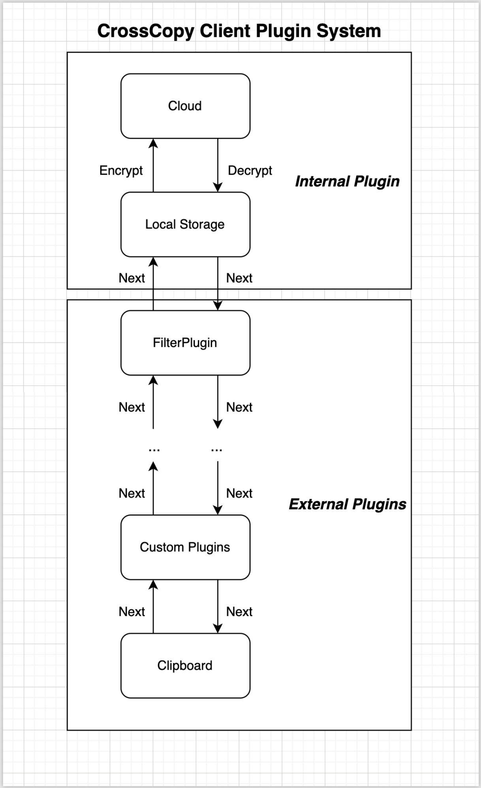

A plugin system has been designed to make the app more extendable.

For now, the plugin system is only available on client-side.

It's quite similar to the 7 layer OSI model.

I want to make the client app pluginable. i.e. The app itself works as a regular clipboard history manager like alfred when no plugins are enabled.

For a plugin design, we need a lifecycle design, basically, preprocessing and postprocessing of data.

With plugins, users can not only use CrossCopy to sync clipboard, but also able to do whatever they want with their data.

Each plugin is like a middleware, consisting of a upload and a download process.

# Upload Process

1. Fetch Data from clipboard
2. Iterate through external plugins to make changes to the clipboard content
   1. Such as filtering out unwanted confidential data
   2. Such as uploading content to notion or databases
   3. Call next to proceed, do not call next or raise error to block the clipboard content from being uploaded.
3. LocalStorage Plugin will save data to local storage to persist data
4. If user is connected to internet and syncing plugin is enabled
   1. Encryption Plugin encrypts data
   2. Syncing Plugin will upload data to cloud using websocket
5. If user isn’t connected to internet or syncing plugin is not enabled
   1. Display the content directly
   2. Handle inUserId properly, add an extra field to indicate that the inUserId is local only if possible

# Download Process

This process is triggered only if syncing is enabled, and can only be triggered by our socketio client, not other external services.

1. socketio’s on upload or update event will trigger the download process
2. Encryption plugin first decrypts the content and pass over to the next stage
3. Iterate through external plugins. Decrypted data will be passed through the external plugins
   1. Most likely no one will be interested to make changes to this data
   2. But if an external plugin provides another layer of encryption, it may make sense to encrypt data.
   3. In this case we may have to handle errors external plugins caused
   4. In order to not disrupt the entire process, I guess we can just try catch, and if there is an error, skip the current plugin and keep going. Display an error message saying plugin “xxx” didn’t work of course.

# Encryption Plugin

So our encryption plugin can be a external plugin, but should it be?

Should it be a paid service?? For now I will say no, if plugins are free to install, people can build their own encryption plugins, which could cause security problem. Let’s just implement a working encryption solution.

Do not give client freedom to turn it off? as that will cause more problem. Encrypted data and decrypted data will be mixed in database, and there could be error while trying to decrypt unencrypted content.

The mixed data problem can be potentially resolved by adding a extra meta data field in `Rec` model storing stringified json data. Each plugin can only access their own data, so that plugins can indicate whether a `Rec` is encrypted or not.

Maybe the built in encryption should be hidden (non external) because we don’t want external plugins to have access to our password hash which will be used as the symetrical encryption key.

# Plugin Design

A plugin should have the following methods

1. Register
   1. Perform initialization, such as adding metadata to all existing users Rec indicating that they have not been processed by this plugin.
2. Unregister
   1. Handle removal of a plugin, such as remove metadata from Rec.
3. preupload
   1. Preprocess data before uploading
4. predisplay
   1. Preprocess data before displaying

The order or plugin is also super important. The download process should have the reverse order of upload process.

There is a problem with register and unregister. The plugin may need to revoke changes made to data, in that case, all existing data should be provided to the plugin. In the encryption scenario, the plugin can read plain text data from client side, encrypt them and update data in cloud. In this case, the update method must be exposed to plugins.

Maybe I have to write a npx package to create a plugin template to include typescript typings.

FK, this is so complicated.

## Sample Architecture

