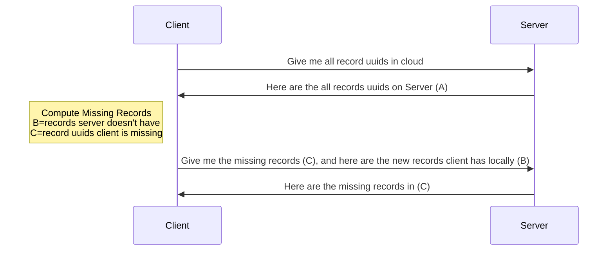
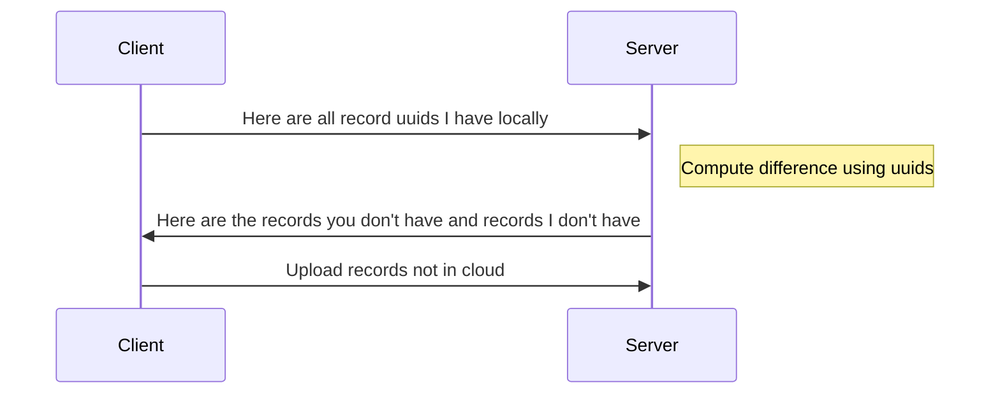
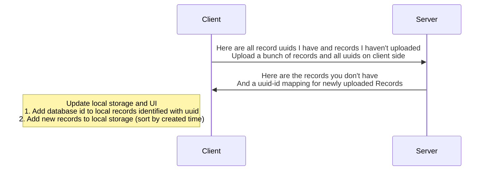
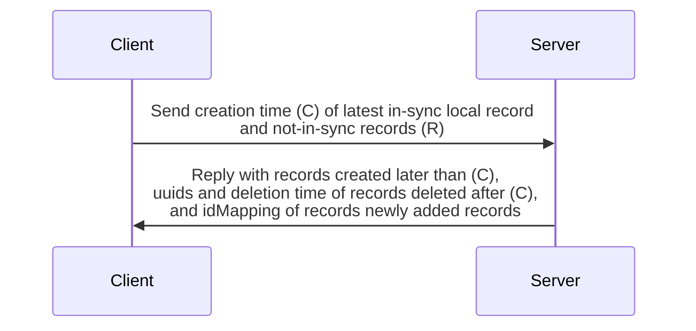

There are multiple ways to sync data, and I design the algorithm with the following components in mind

- Upload offline (client-side) only data to server
- Download missing data (not on client-side) data from server
- Deleted data on server side should be deleted on client-side

## Analysis

## Candidate Designs

### Design 1

1. Get all record uuids
2. Compute the difference (what's missing and what's new (only in local))
3. Request missing records with uuids
   1. Add to local storage
4. Upload new records not in cloud

Step 2 and 3 can be done in parallel (2 GraphQL mutations at once), no extra route needs to be created.

### Design 2

### Design 3

In client-side local storage, where can store whether a record has been uploaded or not.

### Design 4

This design uses minimum bandwidth, and made some assumptions.

To get the deletion in sync across all devices, we need to

- Make sure the `deletedAt` attribute is always the deletion time on server (when server receive the delete request), but not the time it gets deleted on client.

What if client deletes record in offline mode, how does this get synced to cloud?

- Make a local attribute in client-side db called `insync`. Every record in sync with cloud has this column to be true, and locally deleted record has this column to be false.

#### Algorithm

1. With (C), server will find all records created later than (C), including deleted onces, these records will be sent back to client so that client is in sync with cloud.
2. (R) are records not in sync (not local-only records). Records in DB but deleted on client side will also be included. There is a column called `insync` on client-side. When a synced record is deleted locally while offline, the insync attribute will be set to `false`. All records added in during offline will also be not `insync`. When syncing, all not `insync` records will be uploaded.
3. When records are uploaded, they are treated separately.
   1. Newly created records are directly added to database.
   2. Deleted records (`deleted` attribute is `true`) will be updated in DB.
   3. Record content is immutable.
4. What to send back to client?
   1. Deleted records don't have a `deletedAt` attribute on client-side, so when records are deleted, set their `deletedAt` in DB and they should be replied to client.
   2. New records in DB created after **C** will be sent back to client.
   3. Records deleted on server-side after **C** will have their uuids sent back. Client will find records with these uuids and update their `deleted` attribute to `true` and `deletedAt` attribute to the deletion time.

## Conclusion

I will pick Design 4.

Design 1 relies on the most basic GraphQL queries, so I don't need to implement another one, but it takes 2 rounds (requests).

Design 2 requires implementing a dedicated GraphQL request, but 2 requests are needed.

Design 3 requires implementing an extra GraphQL request, but it's only 1 request.

Design 3 is a more atomic and is worth the effort.

Later I designed **Design 4**. **Design 3** requires uploading all uuids of local records, it doesn't seem to be a smart idea.

**Design 4** instead uploads the latest in-sync record's creation time. This is more efficient, and it's also more atomic.

We just need to make sure that the local database is consistent!!! This is super important.

I can still make a wrapper helper for Design 1.

A periodic syncing should be run to prevent any errors. Period: 5 minutes.
