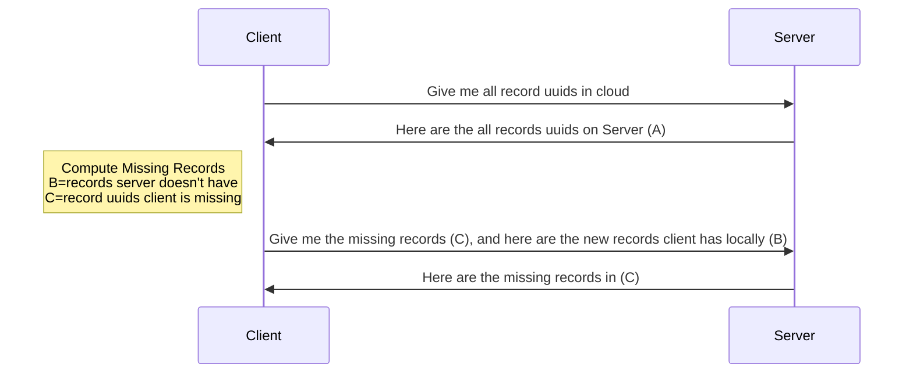
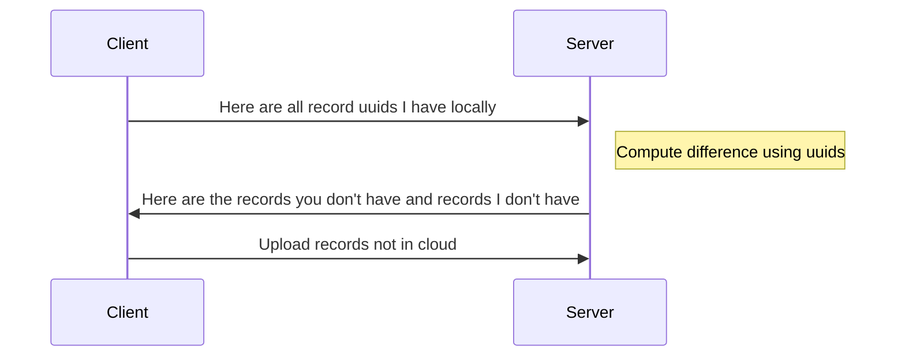
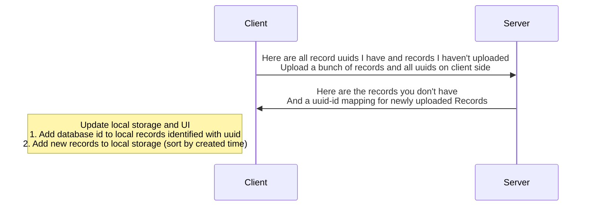
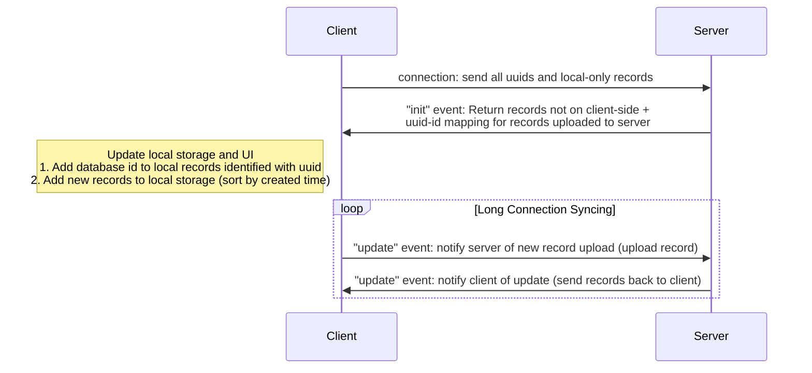

There are multiple ways to sync data, and I design the algorithm with the following components in mind

- Upload offline (client-side) only data to server
- Download missing data (not on client-side) data from server
- Deleted data on server side should be deleted on client-side

## Analysis

## Candidate Designs

### Design 1

1. Get all record uuids
2. Compute the difference (what's missing and what's new (only in local))
3. Request missing records with uuids
   1. Add to local storage
4. Upload new records not in cloud

Step 2 and 3 can be done in parallel (2 GraphQL mutations at once), no extra route needs to be created.

### Design 2

### Design 3

In client-side local storage, where can store whether a record has been uploaded or not.

## Conclusion

I will pick Design 3.

Design 1 relies on the most basic GraphQL queries, so I don't need to implement another one, but it takes 2 rounds (requests).

Design 2 requires implementing a dedicated GraphQL request, but 2 requests are needed.

Design 3 requires implementing an extra GraphQL request, but it's only 1 request.

Design 3 is a more atomic and is worth the effort.

I can still make a wrapper helper for Design 1.

A periodic syncing should be run to prevent any errors. Period: 5 minutes.

# SocketIO Syncing Design

Version 1 assumes that the app will only work when connected to server. UI is updated after server responds.

The new design requires client app to work offline. The design will be similar to the regular request design above, except that this will have a long connection.

A periodic syncing should be run to prevent any errors. Period: ~5 minutes.
