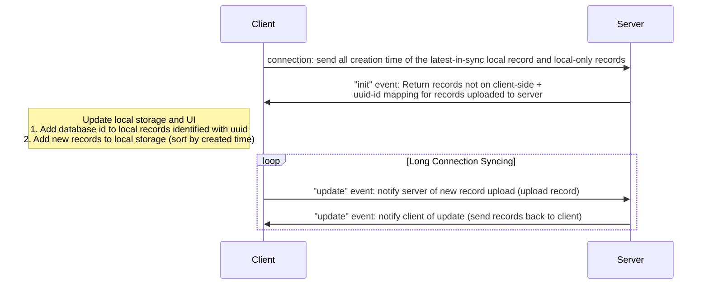

[Socket.IO](https://socket.io/) is a wrapper for WebSocket with many extra functionalities to make things easier.

Socket.IO supports distributed system, I use [redis adapter](https://socket.io/docs/v4/redis-adapter/) to achieve it.

# SocketIO Syncing Design

~~Version 1 assumes that the app will only work when connected to server. UI is updated after server responds.~~

The new design requires client app to work offline. 

The design is similar to the [regular graphql request design (Design 4)](./graphql.md), except that this will have a long connection.

A periodic syncing should be run to prevent any errors. Period: ~5 minutes.
